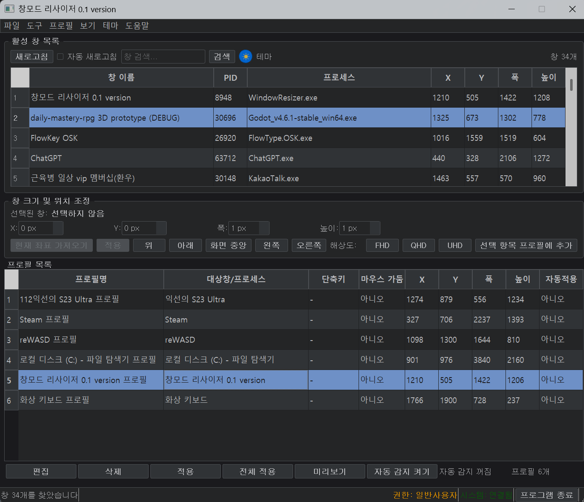

# WindowResizer

[English](README.md) | [한국어](README.ko.md) | [中文](README.zh-CN.md) | [日本語](README.ja.md)

WindowResizer is a Windows desktop application for finding application windows,
moving or resizing them, and repeatedly applying saved window profiles.

Current documented release: 0.01.4

## App preview

## Features

- Select running windows, then move or resize them.
- Save a window's position and size as a reusable profile.
- Match profiles by full executable path to distinguish applications with the
  same filename.
- Preview a saved layout before applying it to a real window.
- Optionally apply a profile when a matching new window is detected.
- Independently enable profile position locking and cursor confinement.
- Register profile-specific global shortcuts for fast profile actions.
- Choose light, dark, or high-contrast themes, and adjust the application's UI
  scale without changing saved window geometry.
- Keep the app available in the system tray after closing its main window, with
  an explicit exit action when you are finished.
- Prevent duplicate application instances in the same Windows session.

## Requirements

- Windows 10 or Windows 11
- Python 3.12 for development, or a built Windows executable

Windows that run with administrator privileges may not be controllable from a
standard-privilege WindowResizer process. Run WindowResizer at the same privilege
level when necessary.

## Run from source

From the repository root, install the dependencies and start the application:

~~~powershell
C:\Python312\python.exe -m pip install -r requirements.txt
C:\Python312\python.exe run_gui.py
~~~

The documented commands use the verified Python 3.12 path so that another
default python installation is not selected accidentally.

## Build the executable

~~~powershell
C:\Python312\python.exe final_build.py
~~~

On success, the build produces dist/WindowResizer.exe. The dist/ and build/
directories are generated artifacts and are not source-controlled.

## Verify changes

Run the focused regression tests for the area you changed. To run the tracked
test suite, use:

~~~powershell
C:\Python312\python.exe -m unittest discover -s tests -p 'test_*.py'
~~~

## Documentation

The installation and user guides are currently Korean. Patch notes are available
in English, Korean, Simplified Chinese, and Japanese:

- [Installation and running guide (Korean)](docs/INSTALLATION.md)
- [User guide (Korean)](docs/USER_GUIDE.md)
- [Changelog: English](docs/CHANGELOG.md) | [한국어](docs/CHANGELOG.ko.md) |
  [中文](docs/CHANGELOG.zh-CN.md) | [日本語](docs/CHANGELOG.ja.md)

## Repository layout

- src/: application source code
- run_gui.py: development launch entry point
- final_build.py: PyInstaller build script
- requirements.txt: Python dependencies
- tests/: tracked regression tests
- docs/: user documentation and images
